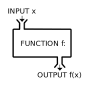
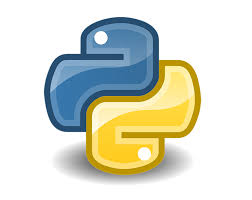
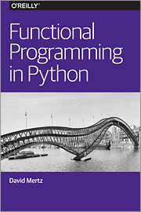
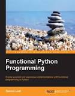

name: title_inversed_whiteText
layout: false
class: center, middle

##Functional Python
 

###Python Grenoble Meetup, 18 Jan 2017
<h3> Mike Bright,  @mjbright </h3>

.left[.footnote[.vlightgray[ @mjbright ]]]

???
SpeakerNotes:

Introduce ourselves.

Why this presentation?

---
name: title_inversed_whiteText
layout: false
class: center, middle

##Functional Python - Tour de Table
.left-column[
     
]

.right-column[

- Who are you?

- Do you know or use Functional Programming?
  - in what languages?
]

.left[.footnote[.vlightgray[ @mjbright ]]]

???
SpeakerNotes:

Introduce ourselves.

Why this presentation?
---

name: title_inversed_whiteText
layout: false
class: center, middle

## Please Challenge me !!

.left[.footnote[.vlightgray[ @mjbright ]]]

I'm not an FP expert

Definitions of FP are discutable

???
Speaker notes:

I'm not expert in this domain but have wanted to present it here for a few years.

Given the interest here there are surely some experts.

Please feel free to interrupt to add information, clarify terms argue with my position - FP is there for that !

---
name: section_overview
layout: false
class: center, left
## What is Functional Programming?
<!-- .red[ TEST ]  .blue[TEST]  .green[TEST]  .yellow[TEST]  .magenta[TEST]  .cyan[TEST]  .pink[TEST] -->

.left-column[
    
    <a href="https://en.wikipedia.org/wiki/Functional_programming"> Wikipedia Functional Programming </a>
]

.right-column[ There is no absolute definition (but common principles).  ]
--
.right-column[
Basic principle is functions without side effects or<br/>state (variables) - unlike Imperative Programming.
]
--
.right-column[ A pure function takes a set of arguments (x) and returns a set of values (y).
Calling the function with the **same arguments** will **always** produce the **same result**.]
--
.right-column[ It has no side effects on it's environment
- no reassignment of variables (not variable!)
- no prints, or writes to disk !!

This doesn't sound very useful though.
]

---
name: section_overview
layout: false
class: center, left
exclude: true
## What is Functional Programming? - 2a
<!-- .red[ TEST ]  .blue[TEST]  .green[TEST]  .yellow[TEST]  .magenta[TEST]  .cyan[TEST]  .pink[TEST] -->

.left-column[
    
    <a href="https://en.wikipedia.org/wiki/Functional_programming"> Wikipedia Functional Programming </a>
]

.right-column[
But Functional Programming is also a set of practices used along with these basic principles

FP is more data oriented.  We apply functions to a data set to create a new data set.

Notions such as
- **Lazy Evaluation**
- Operations such as
  - filter, map, flatMap
- Monads (Collections with certain operations)
  - filter, map, flatMap
- **Typing**
- **Abstract Data Types**
- **Algebraic Data Types**
- **Data is Immutable**
- **Type Classes**
- **Functors**
- **Monads**
- **Closures**

- Signature Pattern Matching

]
???
- Lazy Evaluation
- Typing
- Abstract Data Types
- Algebraic Data Types
- Data is Immutable
- Type Classes
- Functors
- Monads
- Closures

Signature Pattern Matching?

---
name: section_overview
layout: false
class: center, left
## What is Functional Programming? - 2
<!-- .red[ TEST ]  .blue[TEST]  .green[TEST]  .yellow[TEST]  .magenta[TEST]  .cyan[TEST]  .pink[TEST] -->

.left-column[
    
    <a href="https://en.wikipedia.org/wiki/Functional_programming"> Wikipedia Functional Programming </a>
]

.right-column[
Looking at FP concepts as per <a href="https://en.wikipedia.org/wiki/Functional_programming"> wikipedia page </a>

Functional languages provide support for

- 1st-class and higher-order functions
  - functions are objects, can be passed as arguments
  - can return new functions from a function

- Pure functions
  - no side effects (memory or I/O)
  - can be reasoned about
      - provable results
      - optimizations possible

- Recursion
  - "simulate looping" by accumulating results
  - Tail recursion optimization possible (compiler)
  - Higher order functions can factor out recursion
]

---
name: section_overview
layout: false
class: center, left
## What is Functional Programming? - 3
<!-- .red[ TEST ]  .blue[TEST]  .green[TEST]  .yellow[TEST]  .magenta[TEST]  .cyan[TEST]  .pink[TEST] -->

.left-column[
    
    <a href="https://en.wikipedia.org/wiki/Functional_programming"> Wikipedia Functional Programming </a>
]

.right-column[
- Strict (*eager*) versus non-strict (*lazy*) evaluation
    - Should ```length([2+1, 3*2, 1/0, 5-4])``` complete?
    - *lazy* is default in some languages (e.g. Haskell)

- Type systems
    - tend to be strongly typed (may be implicit)
      - static (ML, Scala, Haskell) or
      - dynamic (JS, Lisp, Python)
    - Static typing can facilitate mathematical proofs
    - "*case classes*"

- Referential transparency
    - No state is modified: functions are transparent
    - ```x = x * 10``` is not legal
    - Functions return/accumulate new values
]

---
name: section_overview
layout: false
class: center, left
## What is Functional Programming? - 4
<!-- .red[ TEST ]  .blue[TEST]  .green[TEST]  .yellow[TEST]  .magenta[TEST]  .cyan[TEST]  .pink[TEST] -->

.left-column[
    
    <a href="https://en.wikipedia.org/wiki/Functional_programming"> Wikipedia Functional Programming </a>
]

.right-column[

- Data Structures
    - Linked-lists rather than arrays (random access)
    - Operations on lists such as
      - filter, map, reduce, flatMap

- Monads (Collections with certain operations)
  - filter, map, flatMap
  - used by some languages to handle (isolate) stateful operations such as i/o

]

???

Pure, Lazy Evaluation, Typing, Abstract Data Types, Algebraic Data Types, Data is Immutable, Type Classes, Functors, Monads, Closures

The main differences between language types are:

- Typed languages (e.g., F#, Haskell, OCaml, Scala, Standard ML, Typed Racket) rule out type errors at compile time, whereas untyped languages (e.g., Clojure, Common LISP, Racket, Scheme) wait until run time to detect attempts to apply operations to values that don’t support them.

- Pure languages (e.g., Haskell) expressions have no side effects, and evaluating the same expression (in the same context) produces the same value each time, whereas impure languages (e.g., all the others I mentioned) do not have this property. (Pure languages typically use other means, such as monads, to represent effectful computations.)

- Call-by-name languages (e.g., Haskell) pass arguments to functions as unevaluated expressions and force them as necessary (though Haskell implementations typically use call-by-need, which is an optimization of call-by-name valid in pure languages), whereas most languages are call-by-value, which means that function arguments are evaluated to values before invoking the function. (Scala supports both evaluation strategies in a type-driven manner, and it’s not clear to me what evaluation strategy Coq uses, or whether it even has one.)

- Languages differ in what compile-time metaprogramming facilities they offer. Macros (e.g., in Clojure, Common LISP, Racket, Typed Racket, Scheme, and Scala) allow extending the language by defining new syntactic forms that behave like built-in forms. Scala actually has several varieties of macros, including def macros, which require macro parameters to be well-typed—which prevents them from defining new binding forms—and untyped macros, which don’t require parameters to be well-typed before expansion and thus allow new binding forms. There are weaker forms of compile-time metaprogramming, such as Coq’s notation system, for defining syntactic sugar, and Template Haskell, for compile-time code generation but not defining new syntactic forms (including binding forms). OCaml’s camlp4 supports extending the language by extending the grammar directly.

- Safe languages (e.g., every language mentioned above, C#, Erlang, Java, JavaScript, Lua, Perl, PHP, Prolog, Python, Ruby, Rust, Smalltalk, Tcl) protect their own abstractions, whereas unsafe languages (e.g., C, C++, Objective C, Forth, FORTRAN, and most assembly languages) allow violating abstractions in ways that lead to undefined behavior. I consider this the most important difference when evaluating programming languages, but it’s less salient when talking about functional languages because all the languages mentioned before this bullet are safe (up to some carefully circumscribed features such as foreign function interfaces for interacting with unsafe languages). (Note: I’m considering languages to be safe based on language designer intent—in practice, without a formal proof, languages that we consider to be safe sometimes turn out not to be [e.g., reference cells in early versions of ML, some Java vulnerabilities].)

From Wikipedia page:

First-class and higher-order functions

Higher-order functions are functions that can either take other functions
as arguments or return them as results. In calculus, an example of a
higher-order function is the differential operator {\displaystyle d/dx}
d/dx, which returns the derivative of a function {\displaystyle f} f.

Higher-order functions are closely related to first-class functions
in that higher-order functions and first-class functions both allow
functions as arguments and results of other functions. The distinction
between the two is subtle: "higher-order" describes a mathematical concept
of functions that operate on other functions, while "first-class" is a
computer science term that describes programming language entities that
have no restriction on their use (thus first-class functions can appear
anywhere in the program that other first-class entities like numbers can,
including as arguments to other functions and as their return values).

Higher-order functions enable partial application or currying, a technique
in which a function is applied to its arguments one at a time, with each
application returning a new function that accepts the next argument. This
allows one to succinctly express, for example, the successor function
as the addition operator partially applied to the natural number one.

Pure functions
Pure functions (or expressions) have no side effects (memory or I/O). This
means that pure functions have several useful properties, many of which
can be used to optimize the code:

If the result of a pure expression is not used, it can be removed without
affecting other expressions.

If a pure function is called with arguments that cause no side-effects,
the result is constant with respect to that argument list (sometimes
called referential transparency), i.e. if the pure function is again
called with the same arguments, the same result will be returned (this
can enable caching optimizations such as memoization).

If there is no data dependency between two pure expressions, then their
order can be reversed, or they can be performed in parallel and they
cannot interfere with one another (in other terms, the evaluation of
any pure expression is thread-safe).

If the entire language does not allow side-effects, then any evaluation
strategy can be used; this gives the compiler freedom to reorder or
combine the evaluation of expressions in a program (for example, using
deforestation).

While most compilers for imperative programming languages detect pure
functions and perform common-subexpression elimination for pure function
calls, they cannot always do this for pre-compiled libraries, which
generally do not expose this information, thus preventing optimizations
that involve those external functions. Some compilers, such as gcc, add
extra keywords for a programmer to explicitly mark external functions
as pure, to enable such optimizations. Fortran 95 also allows functions
to be designated "pure".

Recursion
Main article: Recursion (computer science)
Iteration (looping) in functional languages is usually accomplished via
recursion. Recursive functions invoke themselves, allowing an operation
to be performed over and over until the base case is reached. Though
some recursion requires maintaining a stack, tail recursion can be
recognized and optimized by a compiler into the same code used to
implement iteration in imperative languages. The Scheme language standard
requires implementations to recognize and optimize tail recursion. Tail
recursion optimization can be implemented by transforming the program
into continuation passing style during compiling, among other approaches.

Common patterns of recursion can be factored out using higher order
functions, with catamorphisms and anamorphisms (or "folds" and "unfolds")
being the most obvious examples. Such higher order functions play a role
analogous to built-in control structures such as loops in imperative
languages.

Most general purpose functional programming languages allow unrestricted
recursion and are Turing complete, which makes the halting problem
undecidable, can cause unsoundness of equational reasoning, and generally
requires the introduction of inconsistency into the logic expressed
by the language's type system. Some special purpose languages such
as Coq allow only well-founded recursion and are strongly normalizing
(nonterminating computations can be expressed only with infinite streams
of values called codata). As a consequence, these languages fail to be
Turing complete and expressing certain functions in them is impossible,
but they can still express a wide class of interesting computations while
avoiding the problems introduced by unrestricted recursion. Functional
programming limited to well-founded recursion with a few other constraints
is called total functional programming.[38]


Strict versus non-strict evaluation
Main article: Evaluation strategy
Functional languages can be categorized by whether they use strict (eager)
or non-strict (lazy) evaluation, concepts that refer to how function
arguments are processed when an expression is being evaluated. The
technical difference is in the denotational semantics of expressions
containing failing or divergent computations. Under strict evaluation,
the evaluation of any term containing a failing subterm will itself
fail. For example, the expression:

print length([2+1, 3*2, 1/0, 5-4])

will fail under strict evaluation because of the division by zero in the
third element of the list. Under lazy evaluation, the length function
will return the value 4 (i.e., the number of items in the list),
since evaluating it will not attempt to evaluate the terms making up
the list. In brief, strict evaluation always fully evaluates function
arguments before invoking the function. Lazy evaluation does not evaluate
function arguments unless their values are required to evaluate the
function call itself.

The usual implementation strategy for lazy evaluation in functional
languages is graph reduction.[39] Lazy evaluation is used by default in
several pure functional languages, including Miranda, Clean, and Haskell.

Hughes 1984 argues for lazy evaluation as a mechanism for improving
program modularity through separation of concerns, by easing independent
implementation of producers and consumers of data streams.[40] Launchbury
1993 describes some difficulties that lazy evaluation introduces,
particularly in analyzing a program's storage requirements, and proposes
an operational semantics to aid in such analysis.[41] Harper 2009 proposes
including both strict and lazy evaluation in the same language, using
the language's type system to distinguish them.[42]


Type systems
Especially since the development of Hindley–Milner type inference in
the 1970s, functional programming languages have tended to use typed
lambda calculus, rejecting all invalid programs at compilation time
and risking false positive errors, as opposed to the untyped lambda
calculus, that accepts all valid programs at compilation time and risks
false negative errors, used in Lisp and its variants (such as Scheme),
although they reject all invalid programs at runtime, when the information
is enough to not reject valid programs. The use of algebraic datatypes
makes manipulation of complex data structures convenient; the presence
of strong compile-time type checking makes programs more reliable in
absence of other reliability techniques like test-driven development,
while type inference frees the programmer from the need to manually
declare types to the compiler in most cases.

Some research-oriented functional languages such as Coq, Agda, Cayenne,
and Epigram are based on intuitionistic type theory, which allows types to
depend on terms. Such types are called dependent types. These type systems
do not have decidable type inference and are difficult to understand and
program with[citation needed]. But dependent types can express arbitrary
propositions in predicate logic. Through the Curry–Howard isomorphism,
then, well-typed programs in these languages become a means of writing
formal mathematical proofs from which a compiler can generate certified
code. While these languages are mainly of interest in academic research
(including in formalized mathematics), they have begun to be used
in engineering as well. Compcert is a compiler for a subset of the C
programming language that is written in Coq and formally verified.[43]

A limited form of dependent types called generalized algebraic data
types (GADT's) can be implemented in a way that provides some of the
benefits of dependently typed programming while avoiding most of its
inconvenience.[44] GADT's are available in the Glasgow Haskell Compiler,
in OCaml (since version 4.00) and in Scala (as "case classes"), and have
been proposed as additions to other languages including Java and C#.[45]


Referential transparency
Main article: Referential transparency
Functional programs do not have assignment statements, that is, the value
of a variable in a functional program never changes once defined. This
eliminates any chances of side effects because any variable can be
replaced with its actual value at any point of execution. So, functional
programs are referentially transparent.[46]

Consider C assignment statement x = x * 10, this changes the value
assigned to the variable x. Let us say that the initial value of x was
1, then two consecutive evaluations of the variable x will yield 10 and
100 respectively. Clearly, replacing x = x * 10 with either 10 or 100
gives a program with different meaning, and so the expression is not
referentially transparent. In fact, assignment statements are never
referentially transparent.

Now, consider another function such as int plusone(int x) {return x+1;}
is transparent, as it will not implicitly change the input x and thus
has no such side effects. Functional programs exclusively use this type
of function and are therefore referentially transparent.


Functional programming in non-functional languages
It is possible to use a functional style of programming in languages that
are not traditionally considered functional languages.[47] For example,
both D and Fortran 95 explicitly support pure functions.[48]

JavaScript, Lua[49] and Python had first class functions from their
inception.[50] Amrit Prem added support to Python for "lambda", "map",
"reduce", and "filter" in 1994, as well as closures in Python 2.2,[51]
though Python 3 relegated "reduce" to the functools standard library
module.[52] First-class functions have been introduced into other
mainstream languages such as PHP 5.3, Visual Basic 9, C# 3.0, and
C++11.[citation needed]

In Java, anonymous classes can sometimes be used to simulate closures;[53]
however, anonymous classes are not always proper replacements to closures
because they have more limited capabilities.[54] Java 8 supports lambda
expressions as a replacement for some anonymous classes.[55] However,
the presence of checked exceptions in Java can make functional programming
inconvenient, because it can be necessary to catch checked exceptions and
then rethrow them—a problem that does not occur in other JVM languages
that do not have checked exceptions, such as Scala.[citation needed]

In C#, anonymous classes are not necessary, because closures and lambdas
are fully supported. Libraries and language extensions for immutable
data structures are being developed to aid programming in the functional
style in C#.

Many object-oriented design patterns are expressible in functional
programming terms: for example, the strategy pattern simply dictates use
of a higher-order function, and the visitor pattern roughly corresponds
to a catamorphism, or fold.

Similarly, the idea of immutable data from functional programming is
often included in imperative programming languages,[56] for example the
tuple in Python, which is an immutable array.


Data structures
Main article: Purely functional data structure
Purely functional data structures are often represented in a different
way than their imperative counterparts.[57] For example, array with
constant-time access and update is a basic component of most imperative
languages and many imperative data-structure, such as hash table and
binary heap, are based on arrays. Arrays can be replaced by map or
random access list, which admits purely functional implementation, but
the access and update time is logarithmic. Therefore, purely functional
data structures can be used in languages which are non-functional,
but they may not be the most efficient tool available, especially if
persistency is not required.


- Lazy Evaluation
- Typing
- Abstract Data Types
- Algebraic Data Types
- Data is Immutable
- Type Classes
- Functors
- Monads
- Closures

---
name: section_overview
layout: false
class: center, left
## Functional Programming Languages
<!-- .red[ TEST ]  .blue[TEST]  .green[TEST]  .yellow[TEST]  .magenta[TEST]  .cyan[TEST]  .pink[TEST] -->

.left-column[
    
]

.right-column[
In practice languages are more or less *"functional"*.

Some languages such as Haskell are closer to the *"ideal"* of a pure functional language.

Pure languages have the advantage of being provably correct.

Other languages mix paradigms.
 - Scala: OOP, FP
 - Python: OOP, FP
 - JavaScript: "OOP", FP
 - Java: OOP, FP
]

--

.right-column[
Let's compare several languages.

<a href="https://en.wikipedia.org/wiki/Comparison_of_functional_programming_languages"> Wikipedia Functional Prog Lanugaues comparison </a>
]

---
name: section_overview
layout: false
class: center, left
## Functional Programming Languages - 2
<!-- .red[ TEST ]  .blue[TEST]  .green[TEST]  .yellow[TEST]  .magenta[TEST]  .cyan[TEST]  .pink[TEST] -->

.left-column[
    
]

.right-column[
The Functional paradigm can be mixed with others whilst *encouraging* good programming practices.

It facilitates understanding and debugging of code.
]
--
.right-column[
Note: Some say that Object-Oriented Programming is contradictory to Functional Programming because of it's focus on instance variables and the use of getters and setters.

Others see this as a hierarchy of abstractions FP above OOP above libraries (procedures).
]

---
name: section_overview
layout: false
class: center, left
## Functional Programming Languages - 3
<!-- .red[ TEST ]  .blue[TEST]  .green[TEST]  .yellow[TEST]  .magenta[TEST]  .cyan[TEST]  .pink[TEST] -->

.left-column[
    
]

.right-column[
<a href="http://stackoverflow.com/questions/2078978/functional-programming-vs-object-oriented-programming"> StackOverflow: Functional programming vs Object Oriented programming </a>
- OO: good when fixed set of operations on things, and you primarily add new things.
- FP: good when fixed set of things, and you primarily add new operations on existing things.

But when you need to add new operations to OO, or new things to FP we encounter the "*expression problem*".

Scala provides a very usable mix of both paradigms and mixins help address the "*expression problem*".
]

???

From: http://stackoverflow.com/questions/2078978/functional-programming-vs-object-oriented-programming

When do you choose functional programming over object oriented?
When you anticipate a different kind of software evolution:

Object-oriented languages are good when you have a fixed set of operations on things, and as your code evolves, you primarily add new things. This can be accomplished by adding new classes which implement existing methods, and the existing classes are left alone.
Functional languages are good when you have a fixed set of things, and as your code evolves, you primarily add new operations on existing things. This can be accomplished by adding new functions which compute with existing data types, and the existing functions are left alone.
When evolution goes the wrong way, you have problems:

Adding a new operation to an object-oriented program may require editing many class definitions to add a new method.
Adding a new kind of thing to a functional program may require editing many function definitions to add a new case.
This problem has been well known for many years; in 1998, Phil Wadler dubbed it the "expression problem". Although some researchers think that the expression problem can be addressed with such language features as mixins, a widely accepted solution has yet to hit the mainstream.

What are the typical problem definitions where functional programming is a better choice?
Functional languages excel at manipulating symbolic data in tree form. A favorite example is compilers, where source and intermediate languages change seldom (mostly the same things), but compiler writers are always adding new translations and code improvements or optimizations (new operations on things). Compilation and translation more generally are "killer apps" for functional languages.

shareedit
edited May 9 '10 at 8:11
community wiki
2 revs, 2 users 97%
Norman Ramsey
66	 	
There is some serious zen behind this answer. I think it illuminates the fact that certain OOP design patterns (Visitor) are actually hacks which attempt to overcome the problem of adding new operations. – Repo Man Mar 26 '13 at 16:08
30	 	
In JavaScript, you can have all of the things. – Erik Reppen Nov 15 '13 at 17:38
31	 	
@ErikReppen at which point the question arises, when do you choose to use the functional features, and when do you choose to use the object-oriented features? – Norman Ramsey Nov 23 '13 at 0:38
4	 	
@NormanRamsey It's not at all uncommon to mix it up in JS and first-class functions are tied to a lot of JS OOP-related features. JS's array sorting takes functions as an arg which can produce some powerful data structures. Closures + a passed function is used to keep jquery objects very lightweight memory-speaking since most methods are just references. Etc... – Erik Reppen Nov 23 '13 at 0:55 
6	 	
@NormanRamsey: Very good answer, along the lines of SICP. According to this classification, functional and procedural programming are grouped together on the opposite side of object-oriented programming. This could explain the boom of OOP during the late 1980-ies early 1990-ies: when GUIs became mainstream OOP proved to be a good approach for modeling them because you normally have a fixed set of operations (paint, open, close, resize) and a growing number of widgets. Of course, this does not mean that OOP is better than procedural for any application, as you illustrated. – Giorgio Jan 9 '15 at 17:54

---
name: section_overview
layout: false
class: center, left
## Functional Python
<!-- .red[ TEST ]  .blue[TEST]  .green[TEST]  .yellow[TEST]  .magenta[TEST]  .cyan[TEST]  .pink[TEST] -->

.left-column[


]
.right-column[


Python mixes several programming styles such as *Imperative*, *OOP*, *Functional*

Python had first class functions from its' inception.

Support later added for "lambda", "map", "reduce", and "filter" in 1994, as well as closures in Python 2.2.
- lambda functions are convenient unnamed functions
  - declared in a single line (or argument)
  - are pure functions, e.g.
      -   ```incr = lambda x: return x+1```
- ```map(fn, iterable, ...)```
    - Apply fn to each item, return result elements
- ```reduce(fn, iterable, [init])```
    - Apply fn to each item, combining result elements
- ```filter(fn, iterable)```
    - Use fn to select or not each item, return result elements

Python 3 relegated "reduce" to the functools standard library module.
]

---
name: section_overview
layout: false
class: center, left
## Functional Programming in Python
<!-- .red[ TEST ]  .blue[TEST]  .green[TEST]  .yellow[TEST]  .magenta[TEST]  .cyan[TEST]  .pink[TEST] -->

.left-column[


]
.right-column[

Python encourages functional programming by
- Tuples, Namedtuples immutable data types.
- List and Dictionary Comprehensions
  - ```[ x*2 for x in range(3)]``` ==> ```[ 0 1 4 ]```
  - ```{ x: x*2 for x in range(3)}``` ==> ```[ 0 1 4 ]```
- Generator Comprehensions (lazy evaluation)
  - ```( x*2/0 for x in range(3) )```
- Monads
  - PyMonad module

]

---
name: section_overview
layout: false
class: center, left
## Functional Python - PacktPub Index
<!-- .red[ TEST ]  .blue[TEST]  .green[TEST]  .yellow[TEST]  .magenta[TEST]  .cyan[TEST]  .pink[TEST] -->

.left-column[
REMOVE
]

.right-column[

- Functional Programming
- Functional Programming Features
  - 1st-class functions
  - Immutable data
  - Strict and non-strict evaluation
  - Recursion
  - Functional type systems
  - Advanced concepts
-  Functions, Iterators and Generators
-  Collections
-  Higher-order Functions
-  Recursions and Reductions
-  Additional Tuple Techniques
-  Itertools Module
-  Functools Module
-  Decorator Design Techniques
-  Multiprocessing and Threading Modules
-  Conditional Expressions and Operator Modules
-  The PyMonad Library
-  A Functional approach to Web Services
-  Optimizations and Improvements
]

.left[.footnote[.vlightgray[ @mjbright ]]]

---
name: section_overview
layout: false
class: center, left
## Functional Python - OReilly Index
<!-- .red[ TEST ]  .blue[TEST]  .green[TEST]  .yellow[TEST]  .magenta[TEST]  .cyan[TEST]  .pink[TEST] -->

.left-column[
REMOVE
]

.right-column[

- What is Functional Programming ?
- Avoiding Flow Control
  - Encapsulation
  - Comprehensions
  - Recursion
  - Eliminating Loops
- Callables
  - Named Functions and Lambdas
  - Closures and Callable Instances
  - Methods of Classes
  - Multiple Dispatch
-  Lazy Evaluation
  -  The Iterator Protocol
  -  Module: Itertools
-  Higher-order Functions
  - Utility Higher-order Functions
  - The operator module
  - The functools module
  - Decorators
]

.left[.footnote[.vlightgray[ @mjbright ]]]

---
name: section_history
layout: false
class: center, left
exclude: true
## .blue[Subject]
<!-- .red[ TEST ]  .blue[TEST]  .green[TEST]  .yellow[TEST]  .magenta[TEST]  .cyan[TEST]  .pink[TEST] -->

.left-column[
More ...
left column
]

.right-column[
More ...
right column

]

.left[.footnote[.vlightgray[ @mjbright ]]]

---
name: section_subsecn
layout: false
class: center, middle, inverse
## Functional Python Demo
  <br/>

<a href="http://localhost:8888/notebooks/FunctionalPython.ipynb"> Notebook </a>


<!-- <a href="https://github.com/xxx/xxx"/> xxx </a> [xx yy] -->

???
SpeakerNotes:

---
layout: false
class: center, left

## Resources

|   | |    |
|---|---|----|
|  | python.com<br/>Functional Programming HOWTO| <a href="https://docs.python.org/3/howto/functional.html"> HOWTO </a> | 
|  | OReilly<br/>"Functional Programming in Python" | <a href="http://www.oreilly.com/programming/free/functional-programming-python.csp"> Free download </a> |
|  | PacktPub<br/>"Functional Python Programming"| <a href="https://www.packtpub.com/application-development/functional-python-programming"> Info </a> |
|  | github.com<br/>Awesome Functional Python| <a href="https://github.com/sfermigier/awesome-functional-python"> Sources </a> | 


.left[.footnote[.vlightgray[ @mjbright ]]]

---
name: section_qa
layout: false
class: center, middle, inverse
## Thank you !
  <br/>
## Questions?

<!--
#### - <a href="https://github.com/xxx/xxx"/> xxx </a> [xx yy]
-->

???
SpeakerNotes:


